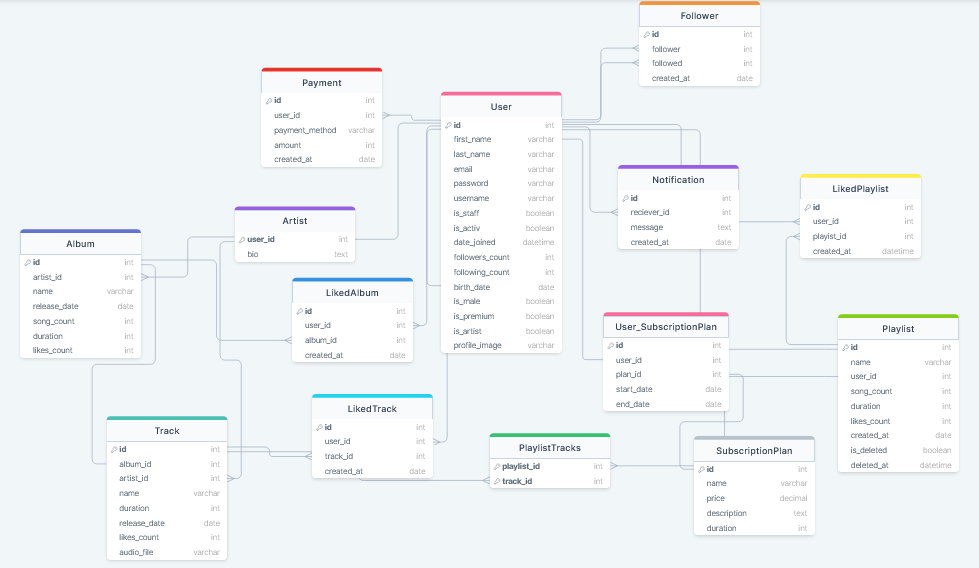

# Music-Streaming-Service

This is the complete backend project for Music-Streaming-Service, a Music-Streaming-Service.
It mimics the complete Spotify or any Music-Streaming-Service API behaviour.

## About

This is a REST API backend for a Spotify clone app that manages users, artists, albums, playlists, tracks, and premium subscriptions. The app also integrates with Stripe to process payments for premium subscriptions.

## Features

- Authentication and authorization
- Forget your password ? can reset it by just a click
- Mailing service, get confirmation mail whenever you
  - Sign up
  - Froget you password
- handling payment using stripe
- Privileges for premium users
- run background tasks using celery
- create your own playlist with only the best songs you like
- Dreamed of being an artist then be one and upload your songs and create your albums.
- Follow your favourite users and artists and be notified whenever the upload something or create albums and playlists
- Get real-time notifications whenever
  - artist you follow uploaded a new album/track
  - some user followed you
- full administrative control, which can be managed entirely by the admin
- Customize every detail about your profile
- Full control for your playlist as an user and your tracks and albums as an artist
- save your favourite tracks, albums and playlists in your library
- Search for your beloved track/artist/user/albums/playlist
- Deleted a playlist by mistake ? Don't worry you can always recover it within 90 days from your recently deleted playlist

## Technologies Used

- Django
- Django REST Framework
- Djagno channels
- Celery

## Prerequisities

To be able to run the project successfully you need to have the following installed on your machine:

1. python
2. pipenv

You can install pipenv using this command `pip install pipenv`

## How to run?

1. Clone this repository
2. Activate the virtual environment: `pipenv shell`
3. Install dependencies: `pipenv install`
4. Run migrations: `python manage.py migrate`
5. seed the database if you would like to, as refered to in the [**Database Seeds**](#database-seeds) section.
6. create a superuser (admin) if you would like to, using command `python manage.py createsuperuser`
7. Start the server: `python manage.py runserver`

Please make sure to install all the prerequisities listed above in the [**Prerequisities**](#prerequisities) section.

## Database Seeds

To seed an empty database before running the project you should run `python manage.py seed_db`, this will use the prewritten seeds stored in \
`store/management/commands` to seed your local database and create a group of users and artists

## API Documentation

I use `Postman` for generating the API documentation, the documentation is hosted on a [API Documentation](https://documenter.getpostman.com/view/24318609/2s93eSYuuP#885cd895-0cca-4836-8d4f-3d58f760a685) and not locally.

## Database Modeling

This Music-Streaming-Service backend application database design.

view it online: [DB Model](https://drawsql.app/teams/raslan-2/diagrams/music-streaming-service) .

